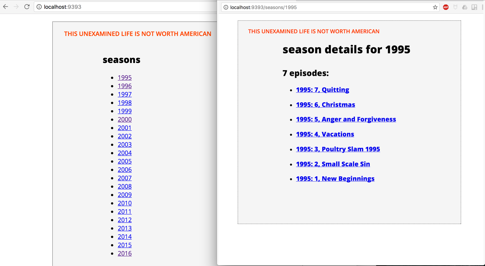

## I'm Laur Skelly and from WDBC in Chicago, this is A Touch of Glass. 

This American Life first hit the airwaves in 1995, when it was called "Your Radio Playhouse". 

My idea for my "Beautiful & Meaningful Project" was to create a toy app that would digest the transcripts of every episode that ever aired and create statistics for the producers who work on the show, sort of like baseball cards. I built the back end for it, and things were going pretty well.  

But then, after all the time spent scraping, designing the schema, writing the migrations and debugging, there was no more time to write the routes and the views. Actually, I did write two routes and two views, but they are not particularly impressive or cool. 

So I did what I thought Ira Glass would do in that situation. I went back to the drawing board. 

What could I do in about 45 seconds that would take the database I had painstakingly designed and populated and turn it into something that could add even the tiniest sliver of delight to the world? 

I present to you, as my minimum minimum, _minimum_ viable product, "A Touch of [Ira] Glass."

The script `touch_of_glass.rb` will pull and print a random sampling of my database's collection of 15,841 utterances made by Ira Glass over the course of 577 episodes (2451 acts, including prologues).

A sampling, below. 

After the break, an instructor named Duke asks a simple question, one that many of us have asked ourselves, some of us hundreds of times, only on this occasion Duke receives an answer that takes him utterly by surprise, and quite possibly one that no one in history has ever heard before. When a plain old Tuesday beomes anything but. Stay tuned.

